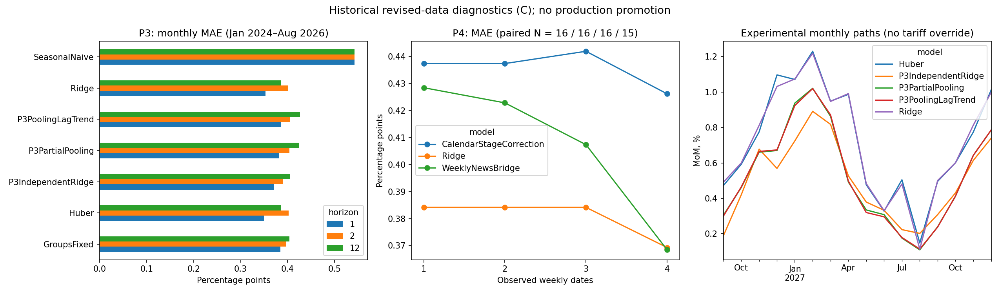

# P3/P4: реализация и проверка гипотезы новой модели

28.09.2026. Реализацию выполняли три субагента Luna. Протокол, исправления по review, запуск сравнений, независимая проверка и окончательные выводы — основной агент.

**Решение: новая реализация готова как исследовательский инструмент, но улучшение основной точности не подтверждено. P3 — NO_GAIN; P4 — INCOMPLETE для полного четырёхстадийного покрытия, без основания для production promotion.** Действующие Ensemble, nowcast сентября 0,50% и траектория ОПР10 не заменены.

## Что реализовано

- P3: независимые групповые Ridge, частично общие коэффициенты внутри трёх семейств и тот же вариант с одним лагированным общим трендом. Одинаковые 45 групп, фиксированная датированная корзина и рекурсивный путь. Стандартизация только по обучающей выборке; семейные коэффициенты и отклонения групп имеют идентифицируемую параметризацию. Параметры закреплены до оценки ошибок.
- P4: регуляризованная поправка к Ridge по неожиданным изменениям недельных индексов продуктов, непродовольственных товаров и услуг, календарю и стадии месяца. Исторические ошибки Ridge получены отдельным fit на каждой прежней отсечке. Сравнение включает контроль с одной календарной поправкой без недельных признаков.
- Переиспользованы загрузчики, корзина, агрегация и существующий monthly evaluator. P4 имеет отдельный runner, поскольку требуется различать последнюю месячную дату обучения и внутримесячную дату недельного наблюдения.
- Кандидаты не добавлены в общий ModelRegistry: его default ensemble автоматически перебирает зарегистрированные классы. Эксперимент запускается явными адаптерами.

План: [POOLED_COMPONENT_EXPERIMENT.md](../../../../docs/POOLED_COMPONENT_EXPERIMENT.md). Протоколы сохранены до вычисления ошибок, код и входы не менялись во время запусков. Исторические данные — современные пересмотренные vintages, уровень доказательств **C**, не настоящий real-time backtest.

## P3: общий исторический тест

Январь 2024 — август 2026, 32 одинаковых целевых месяца; h=1/2/12, 43 отсечки, 672 прогнозные строки, ноль отказов. Более ранние отсечки не включались по результатам read-only preflight: загрузчик корзин 2021–2022 обнаруживает пересекающиеся веса. Это ограничение зафиксировано до просмотра ошибок; тест шока 2022 года на forecast origins не выполнен. Его наблюдения присутствуют в обучении.

MAE, п.п. месячного прироста (h12 — прогноз одного месяца за 12 месяцев до него, не ошибка годовой инфляции):

| Модель | h1 | h2 | h12 |
|---|---:|---:|---:|
| Huber | 0,3493 | 0,4026 | 0,3856 |
| Ridge | 0,3530 | 0,4010 | 0,3865 |
| SeasonalNaive | 0,5428 | 0,5428 | 0,5428 |
| GroupsFixed — предыдущий групповой контроль | 0,3851 | 0,3975 | 0,4035 |
| P3IndependentRidge | 0,3709 | 0,3897 | 0,4047 |
| P3PartialPooling | 0,3824 | 0,4040 | 0,4241 |
| P3PoolingLagTrend | 0,3861 | 0,4053 | 0,4261 |

Общие параметры ухудшили MAE h1 на 0,0114 п.п. относительно независимых групп, общий тренд добавил ещё 0,0037 п.п. ухудшения. Ни одна P3-спецификация не проходит заранее установленный screening против Ridge/Huber: выигрыш MAE хотя бы 0,025 п.п., без ухудшения RMSE, абсолютного bias и доли попадания в ±0,5 п.п. Независимые группы немного лучше на h2, но этого недостаточно для замены месячного прогноза; h12 хуже.

Pooling снижает абсолютное систематическое смещение, но одновременно увеличивает RMSE и проигрывает по попаданиям в рабочий допуск. Этот компромисс нельзя назвать общим улучшением. Все проверки сравнений сохранены в [screening.csv](screening.csv).

**Август отдельно:** факт 0,12%; P3PartialPooling 0,1625% (ошибка 0,0425 п.п.), Huber 0,2271%, Ridge 0,2446%. Это подтверждает опасность выбора по одному месяцу: pooling удачнее в августе, хуже на полном окне. Ранее сохранённый Micro 0,0940% имел ошибку около 0,0260 п.п., но относится к отдельному архивному прогнозу; не добавлялся задним числом в общий рейтинг данного опыта.

Источник расчётов: [P3 metrics](../../model_development/20260928_p3_01/metrics.csv), [forecast rows](../../model_development/20260928_p3_01/forecast_rows.csv), [execution](../../model_development/20260928_p3_01/execution.json).

## P4: ценность недельных новостей

Май 2025 — август 2026. Начало выбрано по наличию минимум 18 различных завершённых месяцев для обучения поправки после накопления истории ожидаемого недельного движения. Все 16 месяцев и четыре стадии сохранены: 192 плановые строки для трёх моделей, 191 доступна. Январь 2026 содержит только три недельные даты — четвёртая стадия WeeklyNewsBridge отсутствует, а оба контроля сохранены. Пропуск не заменён нулём и месяц не вычеркнут из плана.

| Стадия | Парных месяцев | Ridge MAE | Календарная поправка MAE | Недельная поправка MAE |
|---|---:|---:|---:|---:|
| 1 дата | 16 | 0,3841 | 0,4374 | 0,4285 |
| 2 даты | 16 | 0,3841 | 0,4374 | 0,4229 |
| 3 даты | 16 | 0,3841 | 0,4420 | 0,4074 |
| 4 даты | 15 | 0,3693 | 0,4262 | 0,3684 |

На четвёртой стадии выигрыш против Ridge всего **0,00083 п.п.**, при большем абсолютном смещении (0,1532 против 0,1118 п.п.). RMSE и попадания в ±0,5 улучшаются, но MAE-порог не пройден, покрытие неполное. На первых трёх стадиях MAE хуже базы. Выигрыш против более слабой календарной поправки сам по себе не означает пользу относительно Ridge.

Снижение MAE между третьей и четвёртой стадиями нельзя полностью приписывать новой неделе: на четвёртой меняется состав парной выборки. Исторические публикационные даты неизвестны; даты стадий означают наблюдение в файле, а не доказанную доступность месячного факта/недельного релиза в тот день. Источник автоматически генерируется и не имеет полной истории vintages. Равновесные средние недельных индексов — сигнал выборки, а не взвешенный официальный ИПЦ.

**Сентябрь, вспомогательный расчёт по 21.09:** WeeklyNewsBridge **0,4568%**, его собственная база Ridge **0,4991%**. Это дополнительный диагностический ориентир, не основание заменять согласованные 0,50%. Используемая здесь база — `RidgeForecaster(use_macro=False)` с origin-specific predict; она отличается от P3-контракта. Абсолютные метрики между P3 и P4 напрямую не сопоставляются.

Источник: [P4 metrics](../../model_development/20260928_p4_01/metrics.csv), [все плановые строки](../../model_development/20260928_p4_01/forecast_rows.csv), [отказ](../../model_development/20260928_p4_01/failures.json), [сентябрь](../../model_development/20260928_p4_01/september_auxiliary_prediction.csv).

## Диагностика и интерпретация

45 групп существенно различаются по масштабу, сезонности и редким скачкам. В истории с 2016 года найдено 277 групповых наблюдений с |robust z|>4; 31 группа имеет значимую автокорреляцию на 12 лагах. ADF не отвергает единичный корень у 5 групп; KPSS отвергает стационарность у 4. Это описательные тесты без поправки за множественные сравнения, не автоматический выбор трансформации.

Амплитуда календарных медиан особенно велика у яиц (24,03 п.п.), зарубежного туризма (16,27) и плодоовощей (14,92). Простая sin/cos сезонность и объединение таких групп только по широким категориям могут быть слишком грубыми. Это моя интерпретация диагностики, не отдельно доказанная причина неудачи. Шоковые наблюдения сохранены; в этот фиксированный опыт не добавлялись подобранные постфактум dummy или clipping.

У P3 нет взрывного роста агрегата в рассчитанных исторических путях, но pooling увеличил их вариативность: максимум месячного скачка до 0,68 п.п. против 0,38 у независимых групп; максимум самого месячного прогноза до 1,53%. Это ещё одна причина не считать частичное объединение автоматически стабилизирующим. Детали: [source diagnostics](source_group_diagnostics.csv), [path diagnostics](historical_path_diagnostics.csv), отдельные JSON диагностики fit.

[Текущие модельные пути](current_paths.csv) сохранены до декабря 2027 для будущей сверки. Они **не содержат явного тарифного сценария**: например, P3 даёт октябрь 2026 около 0,42–0,46%, существенно ниже ОПР10 1,37%. Отсутствующий календарь тарифов и перенос издержек нельзя заменить статистическим результатом этого опыта. Сценарная траектория остаётся отдельным расчётом.

## Проверка и воспроизводимость

23 теста прошли, включая защиту от будущих месячных/недельных данных и весов, отсутствие подмены пропусков нулями, одинаковую массу корзины, сброс состояния, воспроизводимость, буквальное соответствие параметров и существующий evaluator. При review до запуска исправлены двойное включение тренда и расхождение fit/predict, потенциальное автоматическое включение в ensemble, исключение пропусков из плана P4 и неполные hashes зависимостей.

Независимый [verify_p3.py](verify_p3.py) повторно посчитал метрики всех 672 строк, проверил 384 совпадения групповых сумм с агрегатом и полную массу 45 групп. [verify_p4.py](verify_p4.py) проверил все 192 уникальных плановых слота, 1 явный пропуск, парные метрики и неизменность входов/кода. [verification.json](verification.json), [p4_verification.json](p4_verification.json). `PASS` означает корректность этих проверок, а не превосходство модели. Сравнительный PNG сгенерирован и визуально просмотрен; production charts не регенерировались, поскольку production прогнозы не менялись.

Команды воспроизведения — в плане. Для новых исходов сохранять новые run_id. Нельзя изменять код `sirena/` или `scripts/` во время расчёта: runner инвалидирует результат при изменении fingerprints. `pi-scout` при разведке был недоступен (HTTP 503); использовались ограниченные AST/табличные выборки через `rtk`, полные логи не выгружались.

## Что следует из результата

Моя первоначальная гипотеза оказалась полезной для проверяемого эксперимента, но не дала ожидаемого улучшения в выбранной реализации. Массовый подбор penalties по этим же 32 месяцам сейчас был бы повторением прошлой ошибки выбора по удачному окну. Этот запуск закрыт с отрицательным результатом; он не исключает все возможные hierarchical-модели.

Следующая обоснованная работа — аудит истории корзин до 2023 года и заранее ограниченные отдельные механизмы для плодоовощей, регулируемых услуг и топлива. Недельному модулю нужны раздельные товарные сигналы/покрытие и проверка конкретного продукта, а не только три средних. Такой следующий опыт требует нового протокола и будущих контрольных месяцев. В рамках текущего задания он не подбирался. Опубликованные прогнозы сентября и октября–ноября сохраняются для честной будущей проверки.
