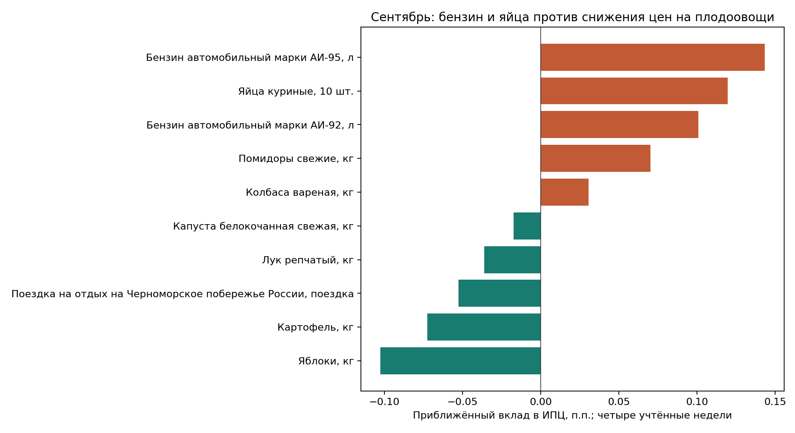

# Сентябрьский nowcast КБР на 28 сентября 2026 года

**Рабочая оценка: +0,50% м/м (ИПЦ 100,50). Сценарный диапазон: +0,25…+0,75%.**
Последнее наблюдение в обновлённом файле — 21 сентября. Отсечки 31 августа, 7, 14 и 21 сентября дают четыре из пяти операционных недель. Перенос 31 августа в сентябрь соответствует ранее утверждённому `data/weekly_accounting_month_overrides.csv`; дата самого наблюдения не менялась. Отсечки 28 сентября в файле ещё нет. Это прогноз полного месяца, не официальный факт.

## Сопоставление оценок

| Расчёт | Сентябрь, % м/м | Интерпретация |
|---|---:|---|
| Рабочая экспертная оценка | **0,50** | Округлённый ориентир после проверки весов и состава |
| Недельные индексы с весами + Micro для ненаблюдаемой корзины | 0,5107 | Экспериментальная диагностика, формула ниже |
| Без модельного снижения топлива в последнюю неделю | 0,5340 | Более уместная предпосылка устойчивых цен бензина; итоговый ориентир также 0,50 |
| То же, последняя неделя без изменения наблюдаемых цен | 0,5162 | Проверка чувствительности к продолжению |
| Штатный технический Nowcast | 0,3561 | 90% недельного bridge + 10% модельной части |
| Модельный Ensemble после августа | 0,5217 | Без экспертной недельной подстановки |
| Micro до недельной подстановки | 0,1986 | Его недооценка текущего топлива повышает риск низкого прогноза |
| Отправочная траектория от 28 сентября | 0,60 | Предыдущий месячный ориентир; на 0,10 п.п. выше нового nowcast |

Штатная недельная цепочка даёт +0,2934% за наблюдаемую часть, с продолжением — +0,3374%. Внутри укрупнённых групп она усредняет позиции без индивидуальных весов: поездка на отдых, яблоки и другие позиции получают несоразмерное фактической корзине значение; агрегат бензина соседствует с марками. Кроме того, в этом историческом методе остаются групповые веса 2025 года. Поэтому +0,3561% сохраняется под собственным названием, а не выдаётся за взвешенную оценку. Сравнение уровней средних цен даёт иной сигнал +0,4536%, также без индивидуальных весов.

## Основные наблюдаемые изменения

В таблице — произведение опубликованных недельных индексов за четыре операционные недели и приближённый вклад с текущими весами. Это ещё не официальный месячный вклад.

| Позиция | Изменение, % | Вклад в ИПЦ, п.п. |
|---|---:|---:|
| Бензин АИ-92 | +9,84 | +0,101 |
| Бензин АИ-95 | +9,29 | +0,143 |
| Бензин АИ-98 и выше | +12,86 | +0,015 |
| Яйца | +22,00 | +0,119 |
| Помидоры | +12,21 | +0,070 |
| Яблоки | −19,94 | −0,103 |
| Картофель | −11,87 | −0,073 |
| Лук | −15,35 | −0,036 |
| Отдых на Черноморском побережье | −25,63 | −0,053 |

**Топливо:** три марки бензина вместе дают около +0,259 п.п. уже в наблюдаемой части месяца. Это подтверждает ценовое давление, о котором говорилось в предыдущем прогнозе. Данные сами по себе не доказывают причинный вклад проблем НПЗ. Старый Micro всё ещё закладывает месячное снижение АИ-92 на 4,50% и АИ-95 на 3,79%, что расходится с наблюдаемым ростом. Даже механическая доля этого снижения в последней неделе сомнительна: при запрете отрицательного продолжения топлива взвешенная оценка повышается с +0,5107 до **+0,5340%**. Для содержательного вывода предпочитаю этот вариант сохранения давления; округлённая оценка +0,50% остаётся прежней. Дизель, в отличие от бензина, за четыре недели снизился на 2,17%: единого движения всех видов топлива нет. Дополнительный перенос транспортных и производственных издержек на другие товары возможен с лагом; отдельную произвольную надбавку поверх уже наблюдаемого подорожания в сентябрь не добавляю.

**Плодоовощи:** рост помидоров пока не перекрывает удешевление яблок, картофеля, лука и других овощей. Автоматически переносить исторический осенний рост на весь сентябрь было бы ошибкой. Это согласуется с [ретроспективой](../produce_patterns_20260928/REPORT.md): сентябрь неоднозначен, более устойчивый разворот приходится на октябрь–ноябрь. Снижение плодоовощей сейчас не снимает риск ускорения после завершения уборочного сезона.

**Тарифы:** предполагаемые примерно 10% октябрьской индексации относятся к следующему месяцу. В сентябрь прямой тарифный скачок не переношу. Новый сентябрьский сигнал сам по себе не является основанием снять октябрьский тарифный риск или ноябрьский перенос издержек.

## Как рассчитана взвешенная диагностика

Переиспользованы загрузчик `sirena/data/weekly_bridge.py`, сопоставление из `experiments/weekly_laspeyres_nowcast/run_weekly_laspeyres_nowcast.py` и готовая сентябрьская траектория `data/micro_forecast_components.csv`. Веса — текущий `data/micro_sprav.csv`; сумма весов полной Micro-корзины проверена на 1.

107 недельных позиций сопоставлены со 110 месячными позициями, включая четыре тарифа электроэнергии. Их вес **35,265%**. Для остальных **64,735%** сохранён существующий прогноз Micro. Веса не нормируются на узкую недельную выборку.

Для наблюдаемой позиции i:

`F_i = произведение(index_week / 100)`;

`прогноз_i = 100 × [F_i × (1 + Micro_i / 100)^(1/5) − 1]`.

Последняя из пяти операционных недель получает одну пятую месячного логарифмического темпа Micro. Для ненаблюдаемой позиции используется полный сентябрьский Micro-прогноз. Это приближённый мост недельных сигналов к месячному ИПЦ: недельные даты и методика регистрации средних цен не воспроизводят официальный месячный расчёт буквально.

Наблюдаемый взвешенный вклад: +0,282254 п.п.; прогноз ненаблюдаемой части: +0,233968 п.п.; поправка на оставшуюся неделю: −0,005527 п.п. Итого **+0,510695%**. Внутри наблюдаемой части продукты дают +0,023334 п.п., непродовольственные товары +0,308626, услуги −0,049706 до продолжения последней недели.

Диапазон — сценарный, **не доверительный интервал** и не результат бэктеста нового гибрида. Если ненаблюдаемая часть отклонится от Micro на ±0,25 п.п. собственного месячного темпа, а последняя неделя наблюдаемой части — примерно на ±0,20 п.п. от принятого продолжения, суммарное отклонение составит около ±0,23 п.п. Рабочий диапазон округлён наружу до +0,25…+0,75%. Более сильный новый шок может выйти за его пределы.

## Проверка автоматического экспорта

Сравнение выполнено с точным сохранённым исходником предыдущего расчёта из журнала прогнозов, а не с восстановленной таблицей.

- Новый файл: 18 188 валидных строк, история 02.05.2023–21.09.2026; дублей «дата–товар» нет. Предыдущий: 16 865 валидных строк; 164 некорректные строки отфильтровывались загрузчиком.
- Совпадают 16 813 строк: **0 изменений недельных индексов**, 2 изменения уровней средних цен на спички в октябре 2023 года, 32 исправления групповой классификации. Новых строк 1 375, отсутствующих относительно старой версии — 52.
- На общей последней дате старого файла изменён набор: добавились кефир, нафазолин, римантадин, отдых на Черноморском побережье и поездки в Юго-Восточную Азию; исчезли лизобакт, трекрезан и ремонт телевизоров. Поэтому расширение не сводится к простому добавлению трёх недель.
- При сопоставлении с месячными весами исключено ложное fuzzy-соответствие ультрапастеризованного молока пастеризованному. Агрегат «Бензин автомобильный» исключён, марки учитываются отдельно. Телевизор явно сопоставлен месячной позиции 629. Отдых на Черноморском побережье сопоставлен позиции 1083, чья месячная формулировка включает Крым: это небольшая оговорка по охвату, а не доказанное полное тождество услуг.
- После раскрытия составных позиций повторов месячных кодов и двойного учёта весов нет. Полный список, включая fuzzy-соответствия, сохранён в `item_mapping.csv`.
- Опубликованный недельный индекс не всегда равен отношению двух средних цен. Поэтому основной расчёт использует столбец недельного индекса, а сравнение уровней — отдельную диагностику. Нельзя считать эти расхождения ошибкой новой автоматизации без сведений о методике выгрузки.

`data/kbr_weekly_prices_2008_2026.csv` этим расчётом не использовался и не перезаписывался. Его отдельный append-процесс останавливается на новой позиции «Поездки в отдельные страны Юго-Восточной Азии»: нужен явно зарегистрированный код 9559 из `data/items_names.csv`. Настоящий nowcast читает обновлённый файл напрямую; старый канонический ряд не выдаётся за свежий источник.

## Публикация и воспроизводимость

Месячные факты, Ensemble и отправочная траектория до декабря 2027 года сохранены. Обновлён штатный Nowcast в кэше; отдельная взвешенная оценка публикуется в диагностике и на странице `assets/charts/nowcast.html`. Это оперативное уточнение сентября, а не молчаливая замена полного прогнозного пакета.

Расчёт: `python3 archive/results/september_nowcast_20260928/build_nowcast.py`.

Артефакты: [Excel](september_nowcast.xlsx), [вклады](weighted_drivers.csv), [сопоставление](item_mapping.csv), [сводка и SHA-256 источников](summary.json), [аудит источника](source_audit.json), [проверка](verification.json).

